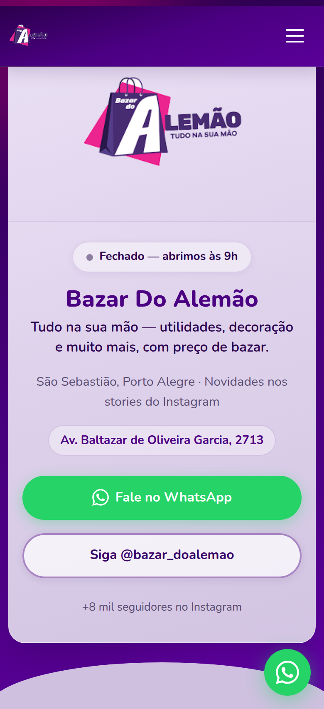
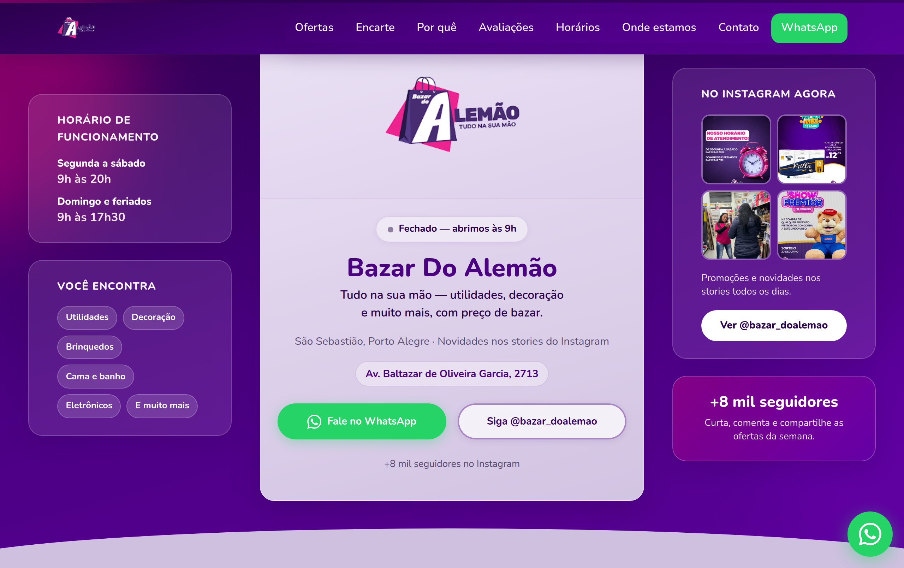
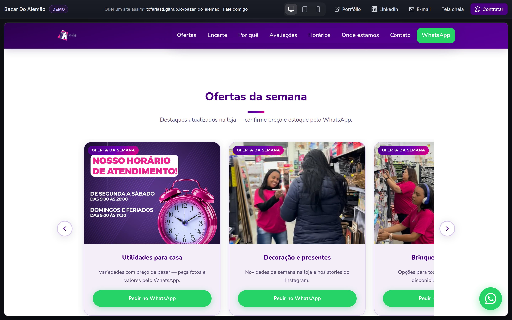
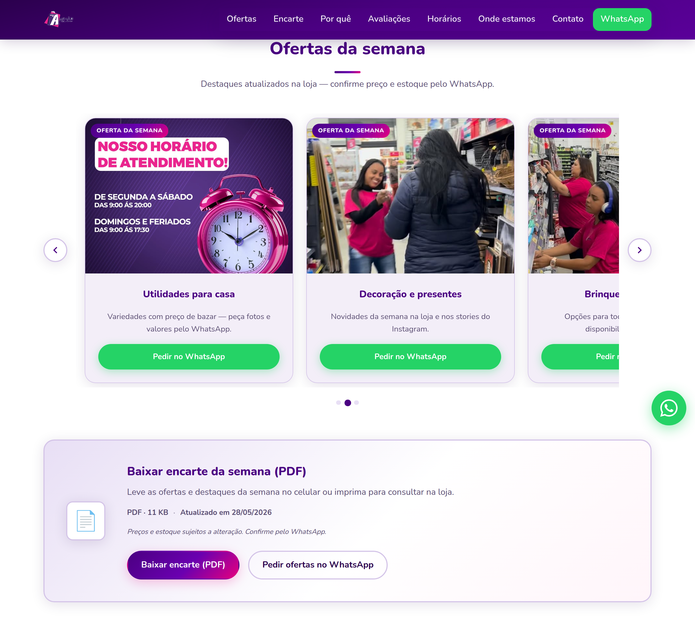
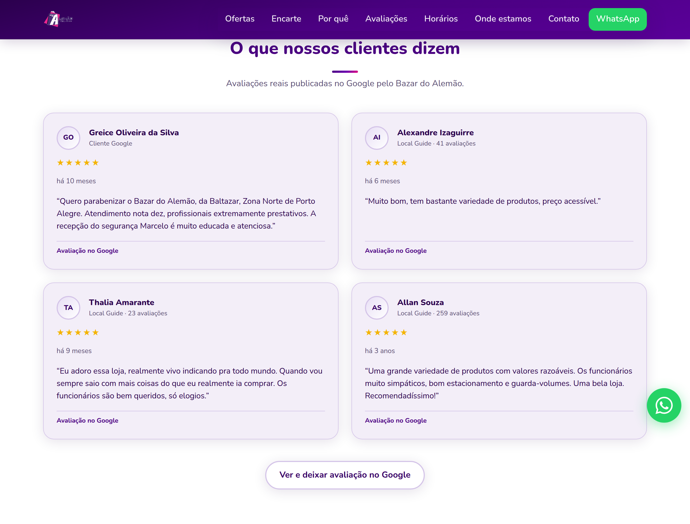
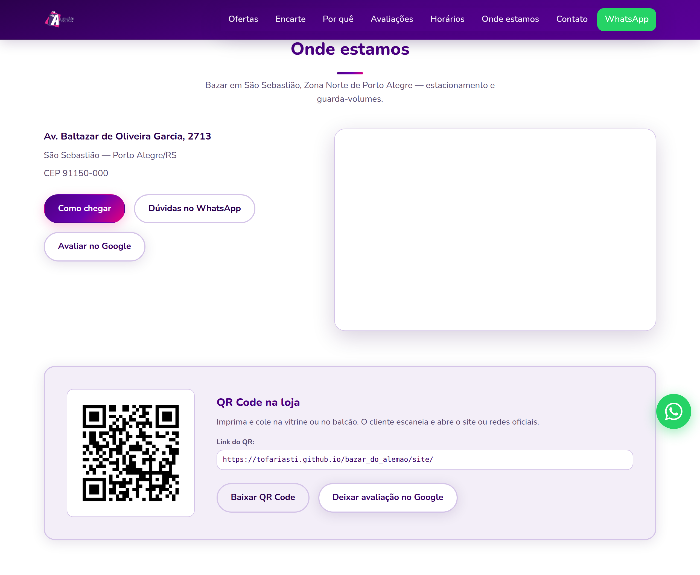

# Bazar Do Alemão — Landing Page

Landing page estática para o [Bazar Do Alemão](https://www.instagram.com/bazar_doalemao/) (@bazar_doalemao), São Sebastião, Porto Alegre.

**Demo online:** [tofariasti.github.io/bazar_do_alemao](https://tofariasti.github.io/bazar_do_alemao/)

**Site (tela cheia):** [tofariasti.github.io/bazar_do_alemao/site/](https://tofariasti.github.io/bazar_do_alemao/site/)

## Pré-visualização

| Mobile | Desktop | Demo com moldura |
|:------:|:-------:|:----------------:|
|  |  |  |

| Ofertas | Depoimentos | Localização | Instagram |
|:-------:|:-----------:|:-----------:|:---------:|
|  |  |  |  |

### Regenerar os prints

```bash
python3 -m http.server 8080 &
npm install
npm run capture:marketing
```

## Rodar localmente

```bash
cd bazar_do_alemao
python3 -m http.server 8080
```

Abra [http://localhost:8080](http://localhost:8080) (demo com moldura) ou [http://localhost:8080/site/](http://localhost:8080/site/) (site em tela cheia).

## Dados da loja

| Campo | Valor |
|-------|--------|
| Endereço | Av. Baltazar de Oliveira Garcia, 2713 — São Sebastião, Porto Alegre/RS |
| CEP | 91150-000 |
| Horários | Seg–sáb 9h–20h · Dom e feriados 9h–17h30 |
| WhatsApp | (51) 98133-5930 — [wa.me/5551981335930](https://wa.me/5551981335930) |
| Instagram | [@bazar_doalemao](https://www.instagram.com/bazar_doalemao/) |

## Encarte em PDF

- Arquivo: `assets/catalogo/encarte-semana.pdf`
- Metadados: `assets/catalogo.json` (tamanho, data, nome do download)
- Regenerar PDF padrão (substitua pelo encarte real do cliente quando tiver):

```bash
python3 scripts/generate_encarte_pdf.py
```

Para usar um PDF feito no Canva/Word, substitua `assets/catalogo/encarte-semana.pdf` e atualize `catalogo.json` (`tamanhoKb`, `atualizadoEm`).

## Depoimentos (Google)

Edite os textos em [`assets/depoimentos.json`](assets/depoimentos.json). A seção aparece em `#depoimentos` no site.

## Ofertas, WhatsApp e QR Code

- **Ofertas da semana:** edite [`assets/ofertas.json`](assets/ofertas.json) (título, imagem, texto do WhatsApp).
- **Mensagens WhatsApp:** edite os textos em [`site/js/main.js`](site/js/main.js) (`WHATSAPP_INTENTS`).
- **Link do site / Google:** edite [`assets/site-config.json`](assets/site-config.json) (`siteUrl`, `googleReviewUrl`).
- **Regenerar QR Code** após mudar a URL do site:

```bash
python3 scripts/generate_qr.py
# ou: python3 scripts/generate_qr.py https://seu-dominio.com.br
```

Arquivo gerado: `assets/images/qr-site.png` (imprimir para vitrine).

## SEO

- **Meta tags e Open Graph** em `site/index.html` (título, descrição, Twitter Card, geo).
- **JSON-LD** (`Store` + `LocalBusiness` + `WebSite` + `WebPage`) — URLs absolutas aplicadas via `site/js/main.js` quando o site roda em HTTP(S).
- **`assets/site-config.json`:** defina `canonicalUrl` com o domínio final (ex.: `https://tofariasti.github.io/bazar_do_alemao/site/`).
- **`robots.txt`** e **`sitemap.xml`:** atualizados para GitHub Pages.
- Validar: [Rich Results Test](https://search.google.com/test/rich-results), [Facebook Sharing Debugger](https://developers.facebook.com/tools/debug/).

## Estrutura

```
index.html              Demo com moldura (iframe)
site/
  index.html            Página principal + JSON-LD
  css/styles.css        Estilos mobile-first
  js/main.js            Menu, WhatsApp, status aberto/fechado
assets/                 Imagens, JSON, ícones
assets/css/preview.css  Moldura da demo
docs/marketing/         Prints para README e WhatsApp
robots.txt              Instruções para crawlers
sitemap.xml             Mapa do site
```

## Atualizar fotos do Instagram

As imagens em `assets/images/instagram/` foram baixadas das publicações mais recentes de @bazar_doalemao. Para atualizar no futuro:

```bash
python3 scripts/download_instagram.py
```

Depois atualize os links `/p/SHORTCODE/` em `site/index.html` conforme `assets/instagram-posts.json`.

## Deploy

Push na branch `main` publica automaticamente no GitHub Pages via Actions. Também pode enviar a pasta para Netlify, Vercel ou servidor Apache/Nginx.
